# BLE-Smart-Bedroom-Environment-Monitor

## Problems Statement

Sleep trouble has been one of the ongoing threats to individual health worldwide. According to the National Institutes of Health (NIH) , approximately 20% to 30% of adults in the U.S. alone have experienced insomnia symptoms, with at least 6% suffering from insomnia disorder. [1] The research has identified that the following key factors impact the sleep quality considerably:[2]

Bedroom Temperature: low temperature on average makes people feel sleepy, whereas a higher temperature keeps individuals awake.
Noise:  Statistics have shown that loud noise disturbances can cause severe sleep fragmentation and disruption, which in turn can have negative impacts on individuals’ physical and mental health.
Light: Studies have found that exposure to strong light sources later in the day can lead to more nocturnal awakenings and less slow-wave sleep, which is  a portion of a sleep cycle that is vital to cell repair and bodily restoration.  It is a good practice to keep the bedroom light levels as low as possible to promote sleep. 

Hence, it is crucial to adjust the above factors properly to create an optimal sleep environment to improve the sleep quality. 

References:  
[1]https://www.goodpath.com/learn/statistics-on-insomnia-in-us-goodpath-results  
[2]https://www.sleepfoundation.org/bedroom-environment

## Project Overview

This project is a Low-Power-Bluetooth-based smart bedroom environment monitor which will promote good sleep quality by measuring and adjusting temperature, light and noise instantly for optimal sleep quality.  According to the research, the team found the following conditions that are promoting better sleep:

- A temperature between 15.6C - 22.0C (changes from person to person)
- No noise disturbance (sound should be between 40db- 55 db)
- During bedtime the lux reading should be less than 180 (inside the house and less than 5 after lights are turned off (inside the bedroom).

The product will monitor and adjust the above three factors of the bedroom environment using 3 sensors so as to meet the above optimal conditions. In addition, the product enables the user to sleep better at any time by promoting the user to set the sleep time and configuring temperature, light and noise values correspondingly and automatically. 

## Hardware Block Diagram

The hardware block diagram shown above is the gist of hardware we will be using in the project. The main two parts are GATT server and GATT Client. The server will have all the sensors connected to it. The sensors that we are using are:

- On-board temperature sensor
- Light sensor
- Sound sensor

The interfaces used for each sensor is also shown in the diagram. Temperature and light sensor work on the I2C bus and the sound sensor will work using the ADC. The LEDs and the LCD display are on board and will be used accordingly. The push button will be used by the user to set sleep timing and will have a GPIO interface. 

## Software Block Diagram

The GATT server requires drivers to manipulate all the attached sensors and silab APIs to manipulate the low-power timer.  And the GATT client needs a custom-built library to convert the target sleep time to associated temperature, light and noise level values. In addition to the above, both parties need APIs to access the LCD display and the GPIO library to manipulate push buttons as well as LEDs. Furthermore, there will be software implementations for the state machines on both the client device and the server device to achieve interaction between each other and present the user interface on both devices. 

## Software Flow Diagram

## Energy Consumption

As the system is composed of both the client device and the server device, the energy consumption performance analysis for each device will be provided in this section. Specifically, the analysis for different states on both devices will be carried out for the comprehensive energy performance analysis. And the team used the Silicon Lab’s Energy Profiler to characterize the low power performance of the GATT server and the GATT client.

### Client Device

According to the sequence of states that the client device needs to go through, as well as the required functionality of user input handling, the energy consumption on the client device can be analyzed in multiple cases, each of which represents a particular operating state that the client has to go through during its operational lifetime. The following are the key phrases of the client device goes through:

1.GATT Service Discovery

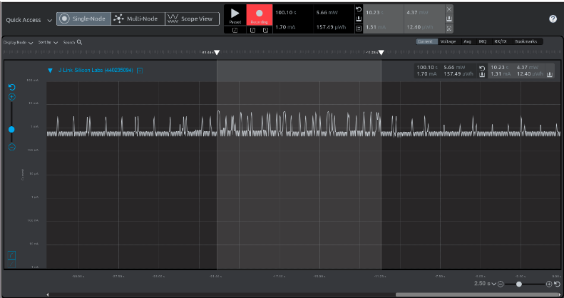

During the service discovery phase, the client discovers all GATT services and the associated GATT characteristics prior to handling user inputs. In this stage, the average consumed current is 1.31 mA, meaning that the client is in EM1 mode.

2.Push Button Presses

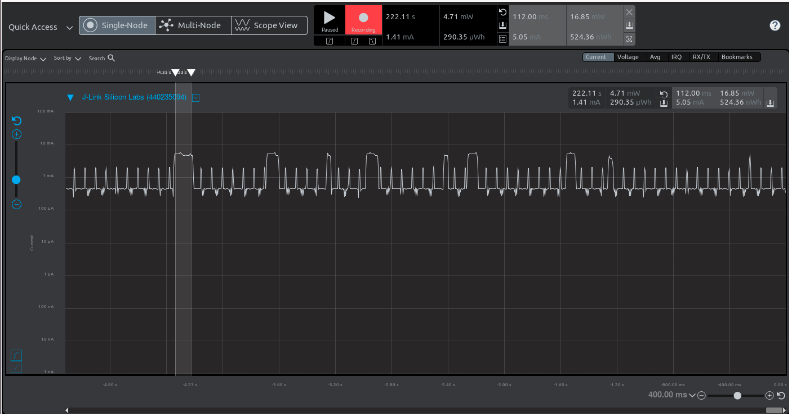

The big square wave highlighted in the energy profiler represents the button pressed by the user. This scenario indicates the user is providing setting values to the client device. And the average current consumed for this activity is about 5.05 mA, meaning that the client is in EM0 mode when handling the user inputs.

3.Writing GATT characteristic values to the server

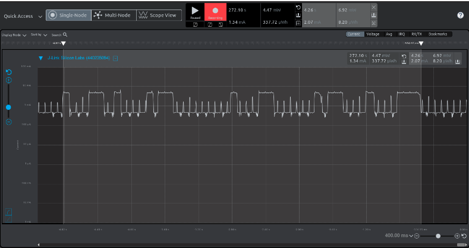

This is the current consumption when the client is writing values to GATT DB. This happens right after the user inputs the values and the client starts writing optimal values to DB. The average current consumed is 2.07 mA. The small spikes are caused by the state machines running on the client for handling user inputs and writing GATT characteristic values to the server.

### Server Device

According to the sequence of states that the server device needs to go through, as well as the required functionality of sensor reading and environment adjustment, the energy consumption on the server device can be analyzed in several cases, each of which represents a particular operating state that the server has to go through during its operational lifetime. The following are the key phrases of the server device goes through:

1.Sampling sensors’ readings

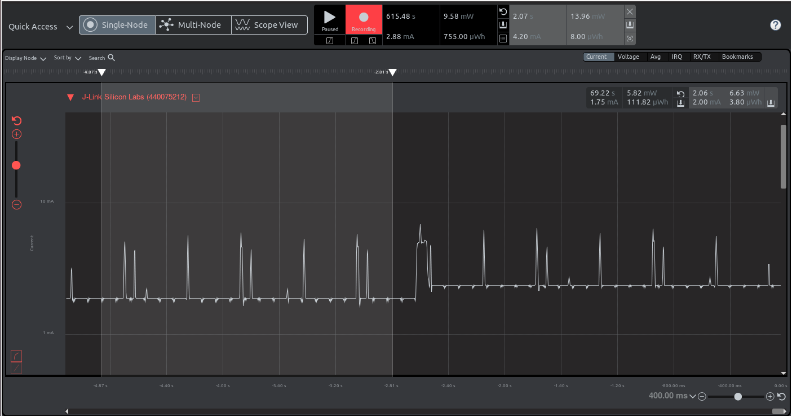

When the server is in idle state, the server will sample the sensor's values. During the sampling period, all three sensors’ values will be sampled and the spikes shown in the highlighted area represent interrupts triggered by ADC0 and I2C0 to notify the server that data is available. The consumed current for this process is around 2.00 mA, meaning that the server is in EM1 mode. 

2.Adjusting the bedroom environment

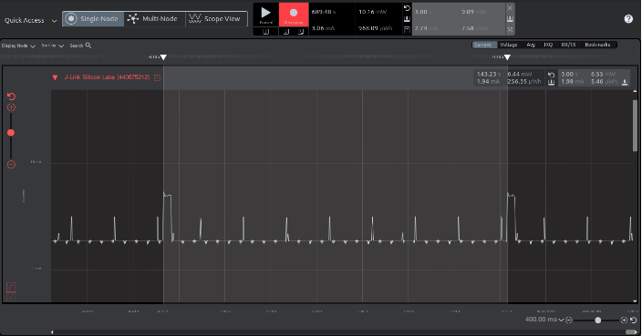

Upon receiving GATT characteristic values from the client, the server stops sampling sensors’ values but displays the optimal values from the client. In this process, only the LETIMER0 and soft timer will trigger interrupts, which are shown in the highlighted interval. The average current in this stage is 1.98 mA, meaning that the server is in EM1 mode, but the server could have been in EM2 mode if sensors and the peripherals are turned off as expected. 

## Demo Screenshots

The following screenshots are taken when performing a LIVE demo, and these screenshots together demonstrate the typical usage of the system.

The client device is initializing:
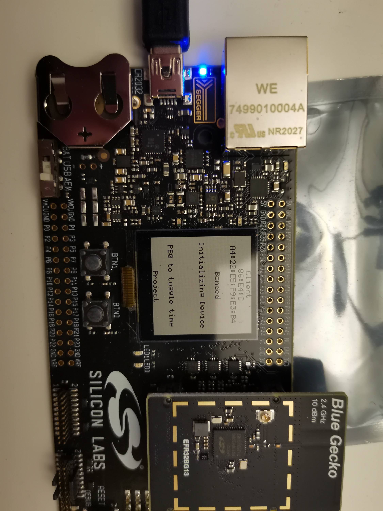

The server device is reading sensors' values:
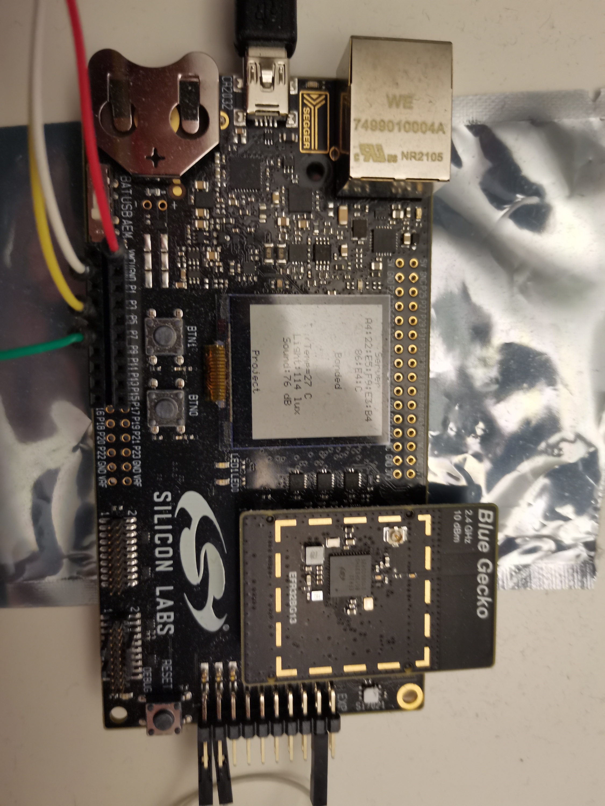

The user is inputting the sleep time:
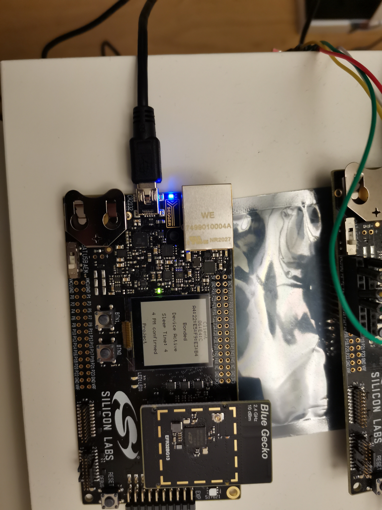

The user is inputting the time reference:
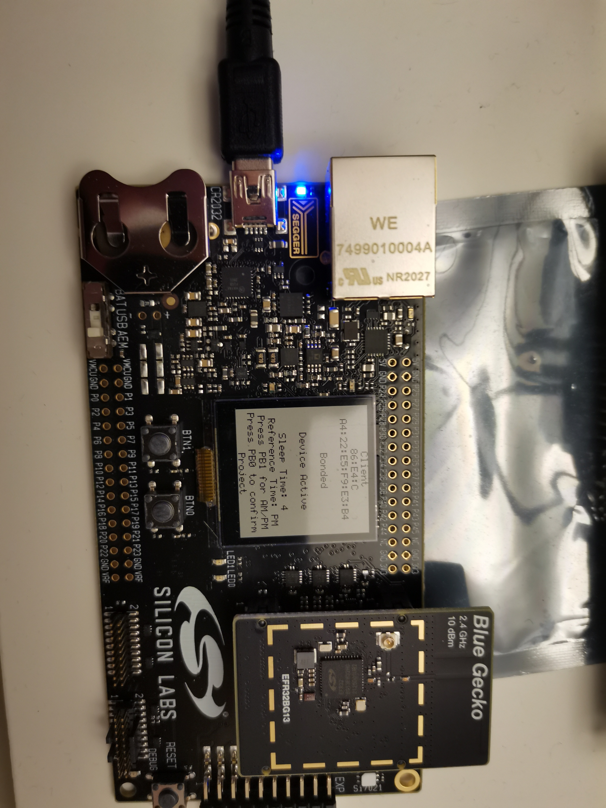

The user is inputting the sleep hours:
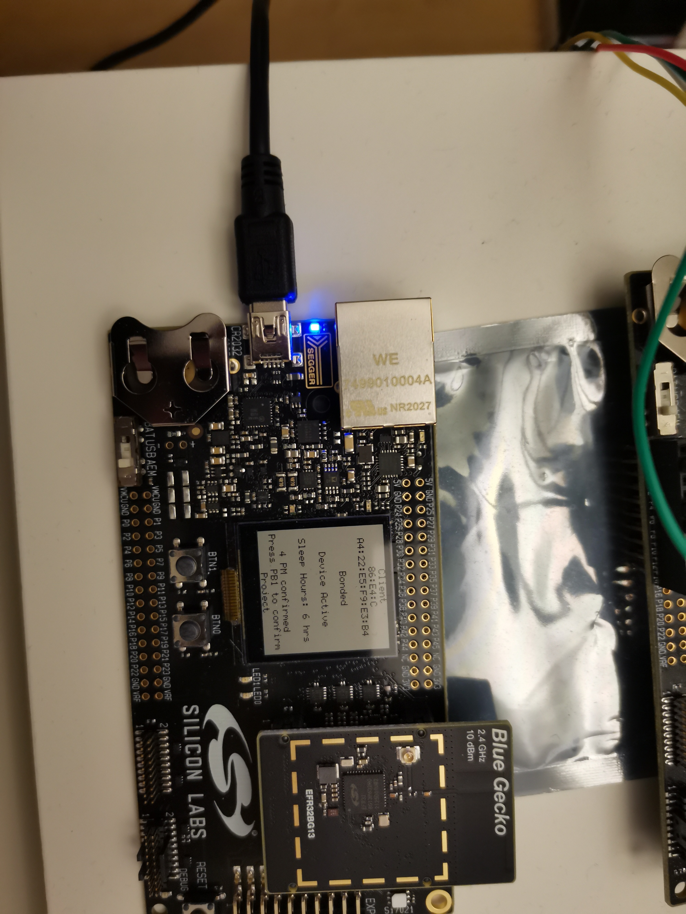

The server is adjusting the bedroom environment:
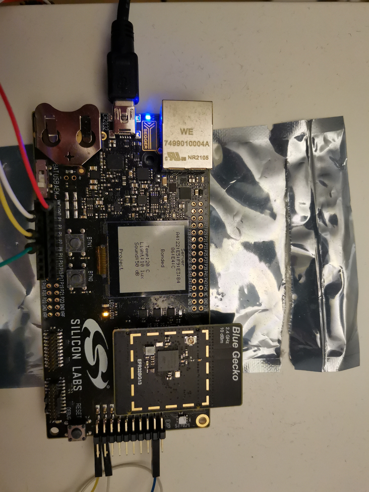

The client is updating the remaining sleep hours:
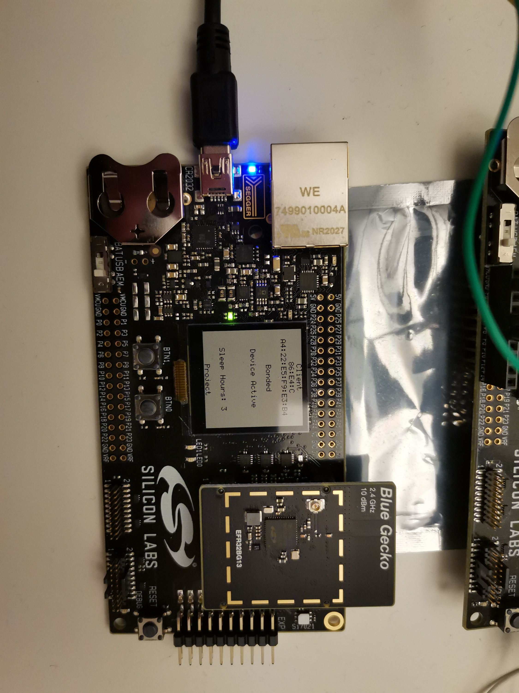
