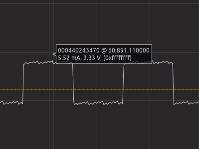
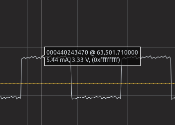
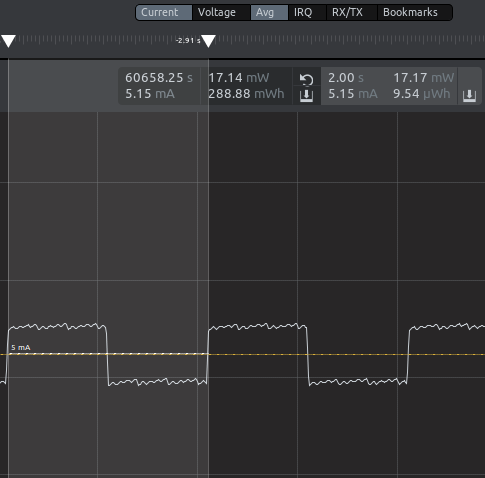
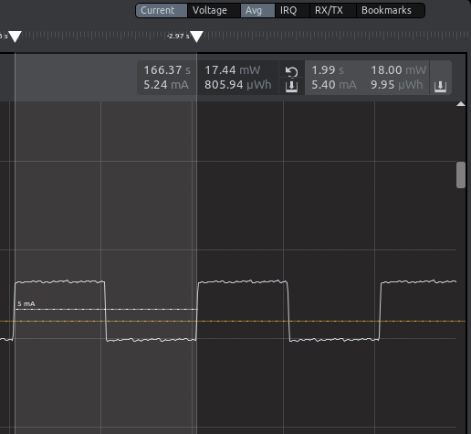

Please include your answers to the questions below with your submission, entering into the space below each question
See [Mastering Markdown](https://guides.github.com/features/mastering-markdown/) for github markdown formatting if desired.

**1. How much current does the system draw (instantaneous measurement) when a single LED is on with the GPIO pin set to StrongAlternateStrong?**

Answer: The instantaneous measurement of the current consumed is 5.52 mA. The range of the consumed current varies from 5.44 mA to 5.51 mA.  
Screenshot:   

**2. How much current does the system draw (instantaneous measurement) when a single LED is on with the GPIO pin set to WeakAlternateWeak?**

Answer: For this question, LED0 is set to WeakAlternateWeak and LED1 is set to StrongAlternateStrong.The instantaneous measurement of the 
current consumed is 5.44 mA. By observation, the range of the consumed current oscillates in the same region as the one observed with the 
StrongAlternateStrong setting for LED0.  
Screenshot:   

**3. Is there a meaningful difference in current between the answers for question 1 and 2? Please explain your answer, referencing the [Mainboard Schematic](https://www.silabs.com/documents/public/schematic-files/WSTK-Main-BRD4001A-A01-schematic.pdf) and [AEM Accuracy](https://www.silabs.com/documents/login/user-guides/ug279-brd4104a-user-guide.pdf) section of the user's guide where appropriate. Extra credit is available for this question and depends on your answer.**

Answer: From my observation,I don't think there is a meaningful difference since the difference is relatively small to notice. Possible reason could be that the measured currents in both cases are above 250 µA, the AEM is therefore accurate only within 0.1 mA. And aprt from the LED toggling, various subsystems are also actively running (this can be seen via API call `sl_system_process_action()`), so the dynamic power consumption is relatively high as the microcontroller is basically running in `EM0` power mode. The high current level makes the small current changes almost negligible, thus causing the current difference to be non-meaningful. 

Additionally, according to the `User LEDs` section at page 3 of the main board schematic, we can see that a 3K-omh load resistor is placed in both `UIF_LED0` line and `UIF_LED1` line, and this makes the output impedance indifferent from whatever the drive settings configured for LED01 and LED00. Specifically, by definition, the drive strength of a GPIO pin means the current that can be drawn, while maintaining the appropriate voltages for logic level inputs. The setting of the drive strength of the output pin essentially alters its output impedance, and so affects the supply current, along with the voltage output. However, a 3K-ohm resistor is large enough to make the change of the output impedance almost indifferent and so the current difference are not as significant as expected. 

**4. With the WeakAlternateWeak drive strength setting, what is the average current for 1 complete on-off cycle for 1 LED with an on-off duty cycle of 50% (approximately 1 sec on, 1 sec off)?**

Answer: The average current for 1 complete on-off cycle for 1 LED with 50% duty cycle is 5.15 mA.  
Screenshot:   

**5. With the WeakAlternateWeak drive strength setting, what is the average current for 1 complete on-off cycle for 2 LEDs (both on at the time same and both off at the same time) with an on-off duty cycle of 50% (approximately 1 sec on, 1 sec off)?**

Answer: The average current is 5.40 mA.  
Screenshot:   

