Please include your answers to the questions below with your submission, entering into the space below each question
See [Mastering Markdown](https://guides.github.com/features/mastering-markdown/) for github markdown formatting if desired.

**Note: All average currents should be taken at a time scale of 200mS/div. See the pop-up menu in the lower-right corner of the Energy Profiler window**

**1. Fill in the below chart based on currents measured in each energy mode, replacing each TBD with measured values.  Use the [Selecting Ranges](https://www.silabs.com/documents/public/user-guides/ug343-multinode-energy-profiler.pdf) feature of the profiler to select the appropriate measurement range.  Your measurements should be accurate to 10%**

Energy Mode | Period (ms) | LED On Time (ms) |Period average current (uA) | Average Current with LED off (uA) | Average Current with LED On (uA)
------------| ------------|------------------|----------------------------|-----------------------------------|---------------------------------
EM0         |    2250      |       175.20        |          5250               |           5210                     |         5690
EM1         |    2250      |       175.00        |          3500               |           3460                     |         3950
EM2         |    2250      |       174.40        |          42.68               |           5.06                     |         501.46
EM3         |    2230      |       175.00        |          42.41               |           3.90                     |         496.02

**2. ScreenShots**  

***EM0***  
Period average current   
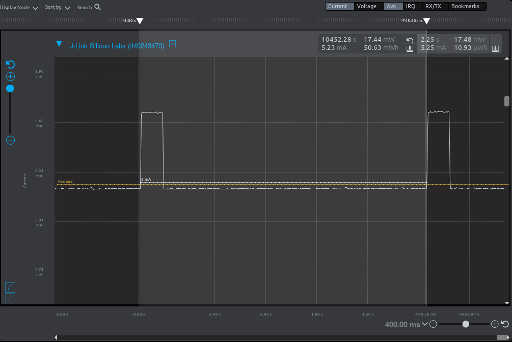  

Average Current with LED ***off***   
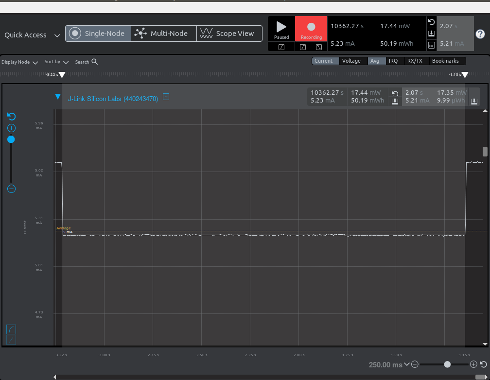  

Average Current with LED ***on***   
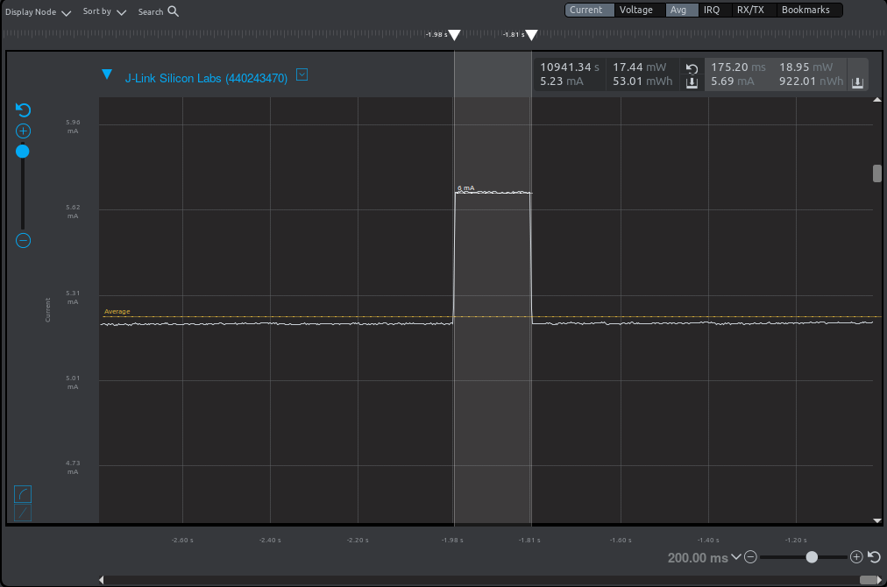  

***EM1***  
Period average current   
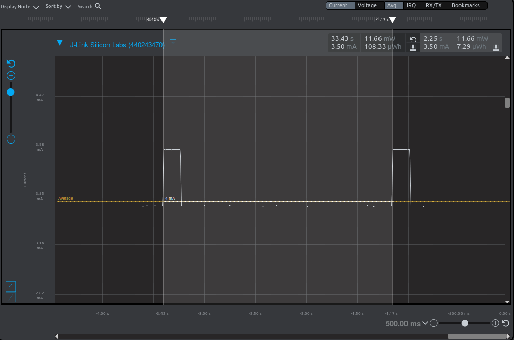  

Average Current with LED ***off***    
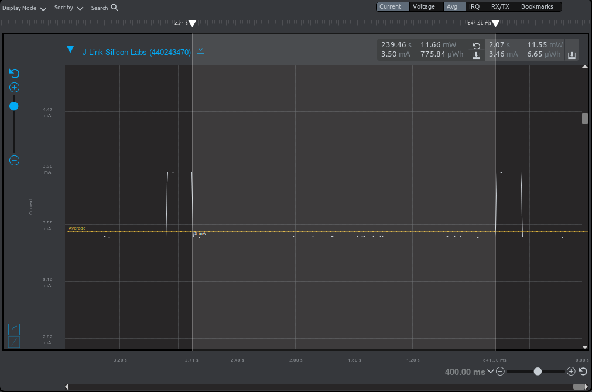  

Average Current with LED ***on***    
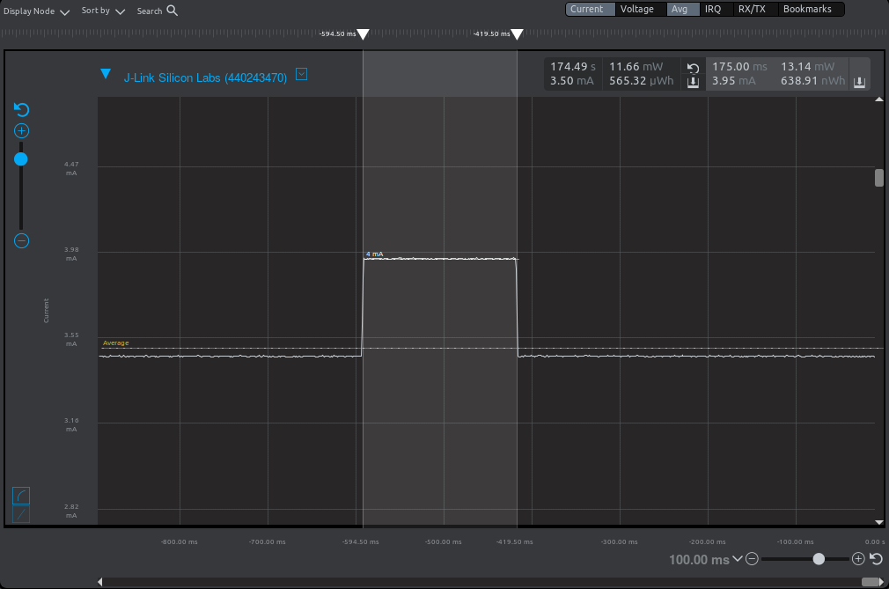  

***EM2***  
Period average current   
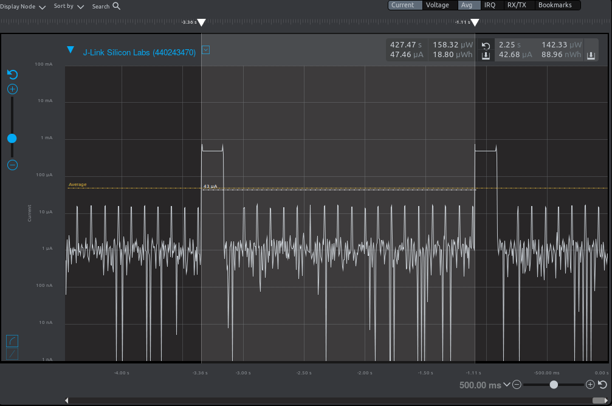  

Average Current with LED ***off***   
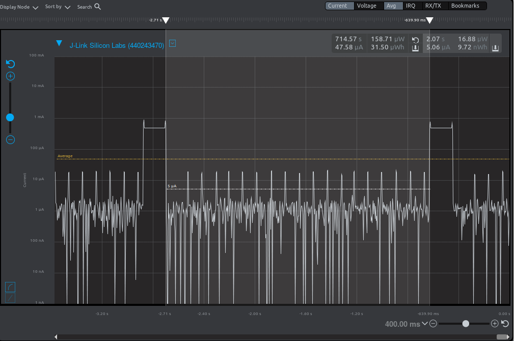  

Average Current with LED ***on***   
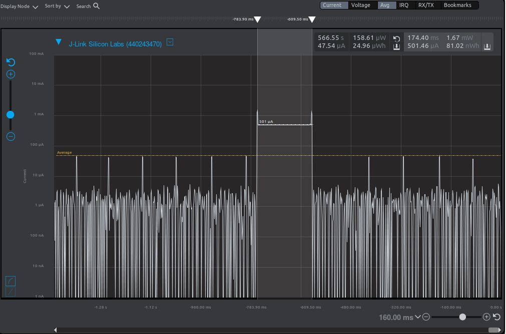  
 
LED measurement - Period    
  

LED measurement - LED on time   
  

***EM3***  
Period average current    
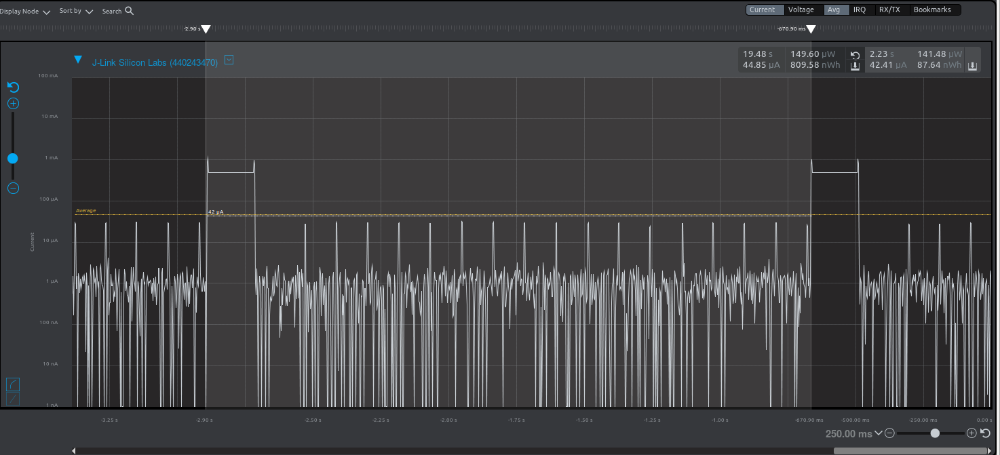  

Average Current with LED ***off***   
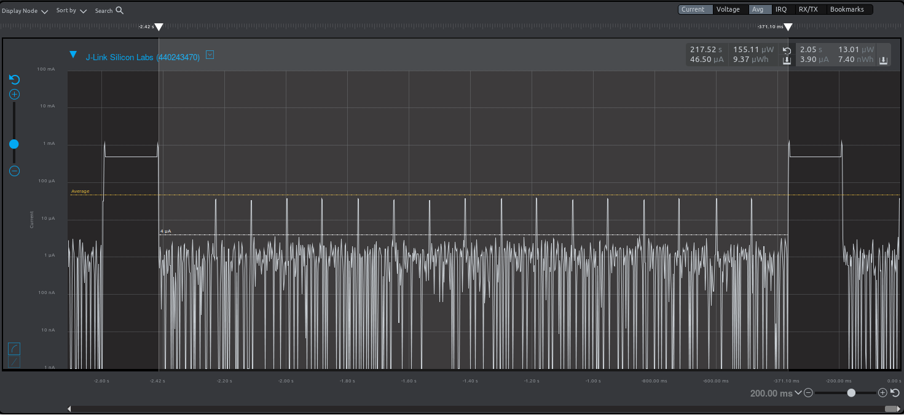  

Average Current with LED ***on***   
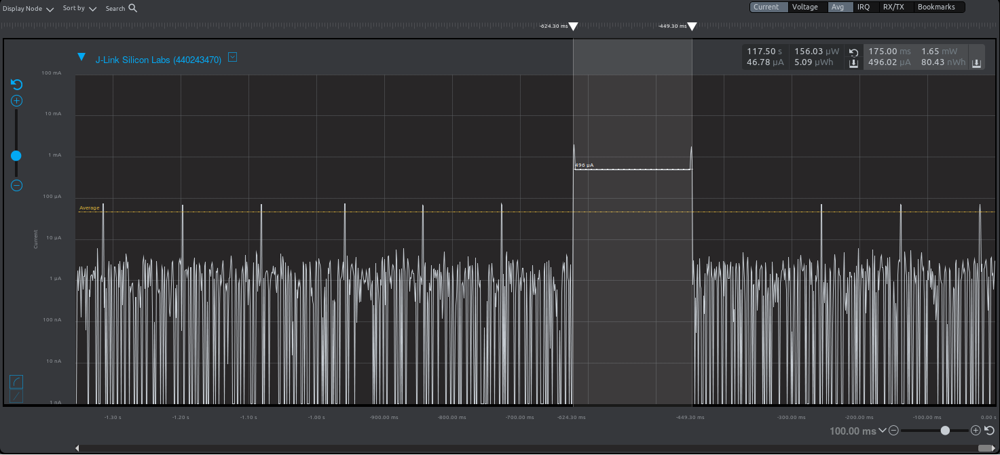  
 
LED measurement - Period    
  

LED measurement - LED on time    
  
 
