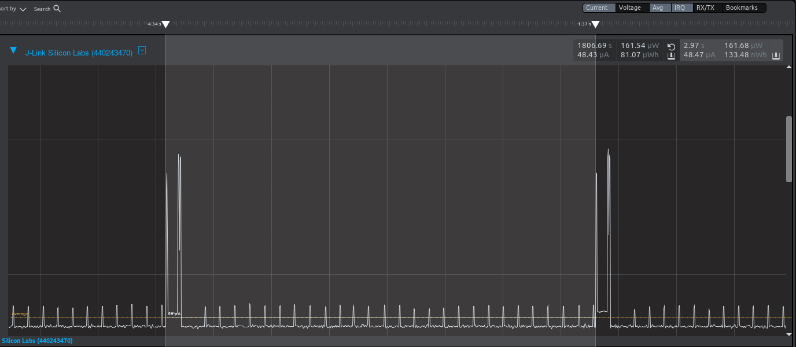
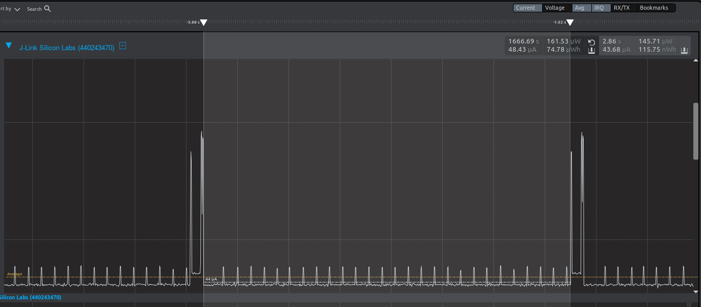
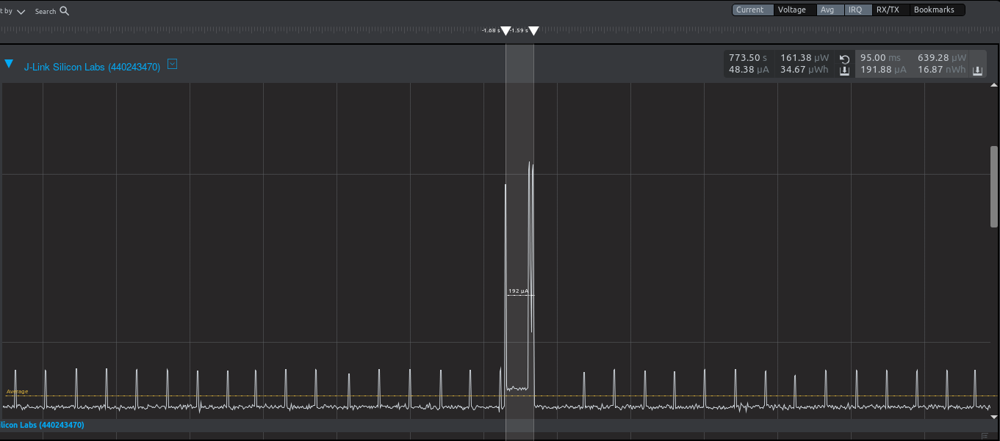

Please include your answers to the questions below with your submission, entering into the space below each question
See [Mastering Markdown](https://guides.github.com/features/mastering-markdown/) for github markdown formatting if desired.

*Be sure to take measurements with logging disabled to ensure your logging logic is not impacting current/time measurements.*

*Please include screenshots of the profiler window detailing each current measurement captured.  See the file Instructions to add screenshots in assignment.docx in the ECEN 5823 Student Public Folder.* 

1. What is the average current per period?
   Answer:   48.47 uA  
    Screenshot:   
     

2. What is the average current when the Si7021 is Powered Off?
   Answer:   43.68 uA  
    Screenshot:   
     

3. What is the average current when the Si7021 is Powered On?
   Answer:   191.88 uA  
    Screenshot:   
     

4. How long is the Si7021 Powered On for 1 temperature reading?
   Answer:   95 ms  
    Screenshot:   
     

5. Compute what the total operating time of your design for assignment 4 would be in hours, assuming a 1000mAh battery power supply?  
   Answer:  

   Since the average current consumption for one period is 48.47 uA, or 48.47 uA/3s, so correspondingly, we have 58164 uA/hr. With a
   battery of 1000mAh, the total number of hours that the design can be operated is (1000000 uAh / 58164 uA/h) = 17.19 hours. 
   
6. How has the power consumption performance of your design changed since the previous assignment?  
   Answer:  
   
   Compared to the previous assignment, the average current consumption drops from 186.78 uA to 48.47 uA per period. Particularly, the primariy contribution comes from the reduction of the current consumption during the sensor-on period, from 4.68 mA down to 191.88 uA, per one 3s period. The duration where the sensor powered on remains roughly the same and the current consumption for the period where the sensor is powered down is also highly similar. 

7. Q7: Describe how you tested your code for EM1 during I2C transfers ?  
   Answer:  

   Two approaches were taken for testing I2C transfers. Firstly, a high-speed event debugger was implemented so that all I2C transfer erroneous statuses were recorded in an array of custom data type. Upon the completion of a I2C transfer, the transfer status would be dumped to the serial console for debugging. Additionally, the logical analyzer was used to monitor the signal changes taken place in I2C wires during a I2C transfer. The monitored data was also recorded for troubleshooting should the transfer failed. 

