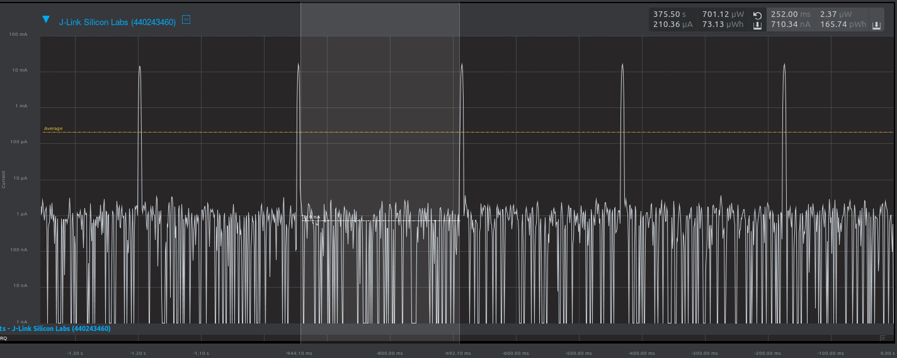
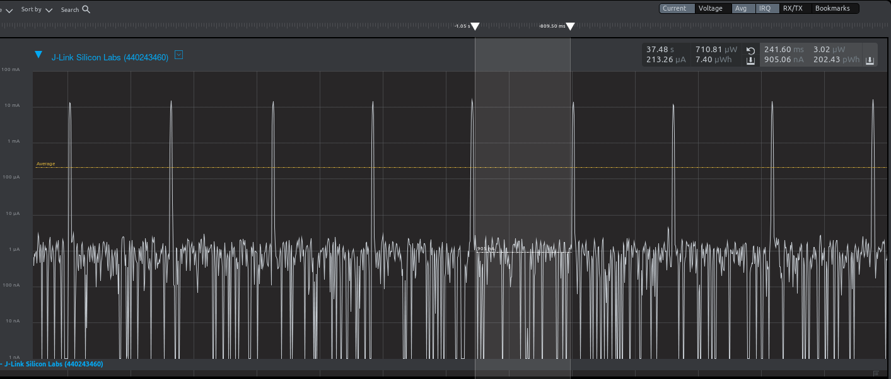
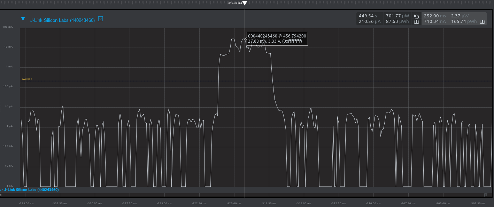
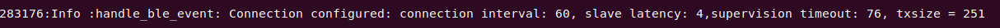
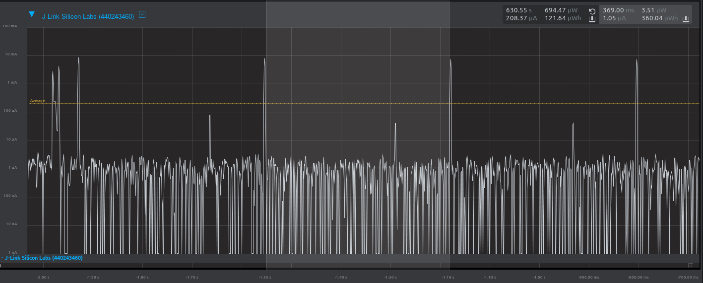
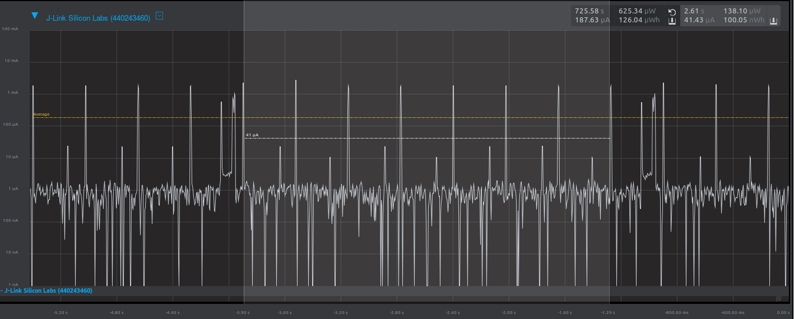
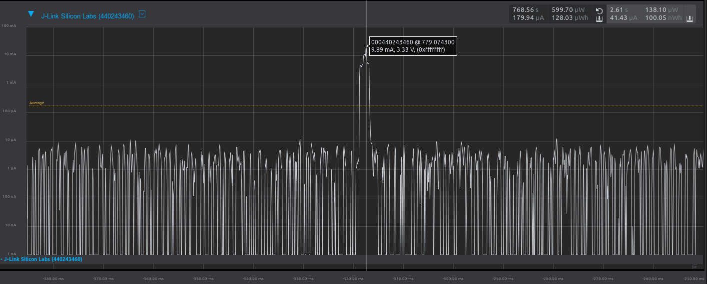
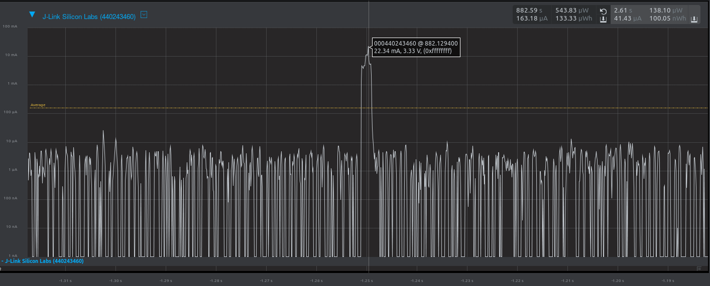

Please include your answers to the questions below with your submission, entering into the space below each question
See [Mastering Markdown](https://guides.github.com/features/mastering-markdown/) for github markdown formatting if desired.

*Be sure to take measurements with logging disabled to ensure your logging logic is not impacting current/time measurements.*

*Please include screenshots of the profiler window detailing each current measurement captured.  See the file Instructions to add screenshots in assignment.docx in the ECEN 5823 Student Public Folder.*

1. Provide screen shot verifying the Advertising period matches the values required for the assignment.  
    Screenshot:   
     

2. What is the average current between advertisements?  
   Answer: 905.06 nA  
    Screenshot:  
     

3. What is the peak current of an advertisement?  
   Answer: 27.68 mA  
    Screenshot:  
     

4. Provide screen shot showing the connection interval settings. Do they match the values you set in your slave(server) code or the master's(client) values?.  
   Answer: The connection parameters match the values configured in the server code.   
    Screenshot:   
     

5. What is the average current between connection intervals?  
   Answer: 1.05 uA  
    Screenshot:   
     

6. If possible, provide screen shot verifying the slave latency matches what was reported when you logged the values from event = gecko_evt_le_connection_parameters_id.  
   Answer: The observed slave latency does not match the expected slave latency. Specifically, the observed slave latency is 7 but the expected slave latency is 4.  
    Screenshot:   
     

7. What is the peak current of a data transmission when the phone is connected and placed next to the Blue Gecko?  
   Answer: 9.89 mA  
    Screenshot:   
     
   
8. What is the peak current of a data transmission when the phone is connected and placed approximately 20 feet away from the Blue Gecko?  
   Answer: 22.34 mA  
    Screenshot:   
      
   
   